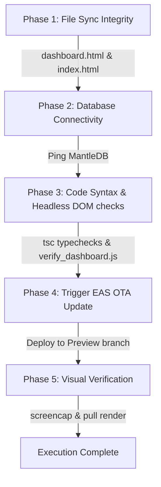

# Antigravity Autonomous Agent-Loop Guide

Welcome to the autonomous quality & deployment orchestrator for **"Where's my family!!"**.

This system bridges the mobile application (Android/iOS) and the web dashboards, allowing both the user and autonomous AI agents (like Antigravity) to build, verify, and deploy changes safely and efficiently.

---

## 🏗️ The Multi-Phase Orchestrator (`scratch/orchestrate.ps1`)

The main entry point for automation is our PowerShell orchestrator. You can run it with:

```powershell
.\scratch\orchestrate.ps1
```

It executes the following 5 phases:



### 🔍 Verification Features

### 1. Headless DOM Static Analysis (`scratch/verify_dashboard.js`)

We headlessly analyze and parse HTML layouts before any live build triggers. It checks:

- HTML syntax & unclosed `<script>` tags.
- The presence of critical MapLibre GL JS, CSS, and Turf.js CDN assets.
- The status of our mathematical GPS filters and robust timestamp parsers.

### 2. Live Database Validation

Pings the MantleDB instance and retrieves active member keys to ensure telemetries are intact and endpoints are accessible.

### 3. Visual Rendering Inspections ("The Agent's Eyes")

If a local Android Emulator (or USB-connected device) is active, the orchestrator triggers:

1.  An on-device snapshot: `adb shell screencap -p /sdcard/autoverify.png`
2.  An asset pull: `adb pull /sdcard/autoverify.png ./scratch/latest_emulator_render.png`

**As an AI agent, I can open and visually analyze this PNG** to confirm trails render cleanly without overlapping labels, layout alignment bugs, or broken canvas renders.

---

## 🤖 Direct Agent Instructions

To trigger an autonomous loop while pair programming, ask me to:

- _"Run headless web checks"_ (verifies dashboard integrity)
- _"Deploy an OTA preview update"_ (compiles typescript, checks linting, publishes via EAS CLI)
- _"Examine the live emulator screen"_ (triggers ADB screenshot and visually inspects layout correctness)

---

## 📦 App Store Release Notes ("What's New") Rule

When compiling, building, and submitting production releases (EAS Build & Submit):
1. **Gather Changes:** Extract the key new features, performance improvements, and bug fixes introduced in this particular build version.
2. **iOS (TestFlight):** Always pass the `--what-to-test` CLI option during the `eas submit` execution. Formulate a clean, bulleted list of the new changes.
   * *Example:* `npx eas-cli submit --platform ios --profile production --what-to-test "• Added in-app feedback drawer\n• Speed-adaptive background tracking"`
3. **Android (Google Play):** Because EAS Submit does not natively upload Android "What's New" release notes, you must:
   * Write the exact release notes to a temporary/release file `whatsnew-android.txt` in the root of the project.
   * Print this text clearly in your final response to the user so they can copy and paste it into the draft/release section of their Google Play Console.

