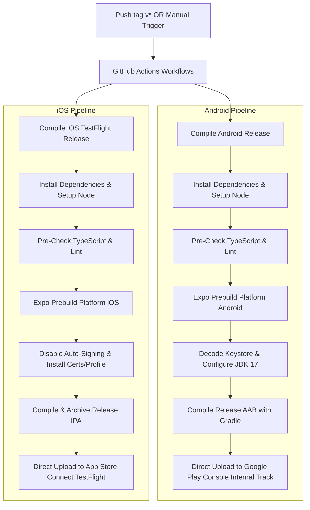

# 📍 Where's my family!!

> **Enterprise-Grade Private Family Tracking & Diagnostics App**
> Built with Expo, TypeScript, React Native Maps, and GitHub Actions Pipelines.

---

## 🚀 Overview

**Where's my family!!** is a secure, cross-platform location-sharing and tracking application designed for family circles. The application provides instant location visibility on a rich interactive map, status indicators (like battery levels, phone state, and relative distance), panic alarms, and persistent background location monitoring that survives device restarts.

This repository is integrated directly with **GitHub Actions** for automated Quality Assurance and cloud-native builds (Android AABs and iOS IPAs) deploying directly to Google Play and Apple App Store.

---

## 🔗 Live Deployments & Quick Links

| Platform / Service           |         Type         | Link                                                                                        |
| :--------------------------- | :------------------: | :------------------------------------------------------------------------------------------ |
| 🌐 **Live Web Dashboard**    | Cloud Run (Toronto)  | [web-dashboard.run.app](https://web-dashboard-979889483805.northamerica-northeast2.run.app) |
| 🤖 **Android Beta Track**    | Google Play Internal | Available on the Google Play Console Internal Testing track                                 |
| 🍎 **iOS Standalone Client** |   TestFlight Beta    | [Join Apple TestFlight Beta](https://testflight.apple.com/join/6780024343)                  |

---

## ✨ Primary Features

### 🗺️ Live Family Dashboard

- **Dynamic Interactive Map**: Beautiful dark-mode maps showcasing your family members' positions, updated in real time.
- **Precise Family Status Cards**:
  - **🔋 Battery Tracker**: Real-time battery percentages and charging indicators.
  - **🛰️ Last-Seen Logs**: Precise relative distance calculation in miles using the Haversine formula and timestamps of the last received coordinates.
  - **📱 Device Activity**: Displays whether the phone is unlocked/active or locked.
- **📍 24H Location Trails (Time-Based Gradients & Snapped-to-Road)**: Visualize complete path histories of family members over the last 24 hours:
  - **Dynamic Color-Coding**: Trails fade dynamically from **Emerald Green** (representing the most recent locations) to **Vibrant Red** (approaching the 24-hour age limit) to instantly see where members were and when.
  - **Road-Snapping Routing Engine**: Uses the **OSRM (Open Source Routing Machine) Route & Match API** to automatically snap raw, noisy GPS coordinates to physical streets, footpaths, and highways, producing smooth, continuous, snapped paths instead of chaotic jagged lines.
  - **Smart Local Performance Cache**: Uses a mutable reference cache to guarantee that OSRM matches are only requested when members get _new_ coordinates, completely avoiding redundant network calls.
  - **Lightweight Offline Fallback (RDP)**: Integrates a local client-side **Ramer-Douglas-Peucker (RDP)** simplification algorithm that acts as an instantaneous offline fallback, rendering a beautifully smoothed raw trail if network connection is lost.

### 🔄 Reboot-Resilient Background Tracking

- **Always-On Background Daemon**: Continues updating the backend database with high-accuracy coordinates even when minimized or fully closed.
- **Android Boot Receiver**: Autostarts on boot complete (`RECEIVE_BOOT_COMPLETED`) without requiring manual intervention.
- **iOS App Relaunch Support**: Wakes the app on significant location movements, preventing native OS terminations.

### 🔧 Premium Diagnostic & Triage Console

- **In-App Terminal**: Sliding neon-green terminal window displaying live log entries (e.g., GPS pings, sync logs, and background tasks).
- **Native Log Share Sheets**: Easily export structured logs via text, email, or system clipboards to debug without developer cables.

---

## 🛠️ Automated Cloud CI/CD (GitHub Actions Workflows)

We utilize **GitHub Actions** to manage code quality, linting, formatting, type-safety checks, and parallel app compilations fully in the cloud—completely bypassing EAS Build limits and ensuring unlimited, free, automated compilation.

The pipelines are triggered manually via **workflow_dispatch** in the GitHub Actions tab, or automatically when a version tag matching `v*` (e.g., `v1.0.12`) is pushed to `master`:



---

## 📚 Detailed Guides & Architecture

To help you or other developers understand, run, or replicate this entire ecosystem, we have compiled comprehensive documentation in the [docs](file:///g:/My%20Drive/AGY-Projects/android-test/wheres-my-family/docs) directory:

1. 🚀 [**Getting Started & Developer Guide**](file:///g:/My%20Drive/AGY-Projects/android-test/wheres-my-family/docs/getting-started.md)
   - Detailed client-side architecture and interactive telemetry flows (Onboarding, GPS, Speed-Adaptive Rates, Battery Icons).
   - E2EE AES-256-CBC and XOR legacy fallback mechanics.
   - Initial local Metro bundler and emulator setup.
2. ☁️ [**Sovereign Backend & Self-Host Guide**](file:///g:/My%20Drive/AGY-Projects/android-test/wheres-my-family/docs/backend-setup.md)
   - Deep dive into our stateless GCP Cloud Functions 2nd Gen API and Firestore database configurations.
   - Step-by-step instructions to replicate and host the backend in your own GCP project under the $0/month free tier.
   - Serverless API security rules, key sanitization, and prototype pollution guards.
3. 📦 [**Build, Release & CI/CD Pipelines**](file:///g:/My%20Drive/AGY-Projects/android-test/wheres-my-family/docs/build-and-release.md)
   - Step-by-step guidelines for local Gradle (`.aab`) and manual Xcode (`.ipa`) builds.
   - Comprehensive walk-through of our automated GitHub Actions workflow files (`android-build.yml` and `ios-build.yml`).
   - Essential repository secrets and Xcode 26 simulator daemon priming configurations.
   - Guidelines for App Store "What's New" release notes updates.

---

## 📦 Developer Guide

### Prerequisites

- **Node.js** (LTS or latest)
- **npm** or **Yarn**
- **Expo Go** app installed on your test devices (Client version **54.0.8** or compatible Expo SDK 54 runner)

### Setup

1. Clone the repository:
   ```bash
   git clone https://github.com/fkcurrie/wheres-my-family.git
   cd wheres-my-family
   ```
2. Install dependencies:
   ```bash
   npm install
   ```

### Local Development Scripts

- 🚀 **Start Metro Bundler**: `npm start`
- 🤖 **Run on Android**: `npm run android`
- 🍎 **Run on iOS**: `npm run ios`
- 🩺 **Check Project Health**: `npx expo doctor`
- 🏗️ **Compile Check**: `npm run typecheck`
- 🚨 **Quality Audit (ESLint)**: `npm run lint`
- 💅 **Autoformat Code**: `npm run format`

---

## 🛡️ Privacy & Security

This is a private, family-centric repository.

- Coordinates are kept secure and shared only within defined private channels.
- Tracking can be fully disabled in the app settings at any time.
