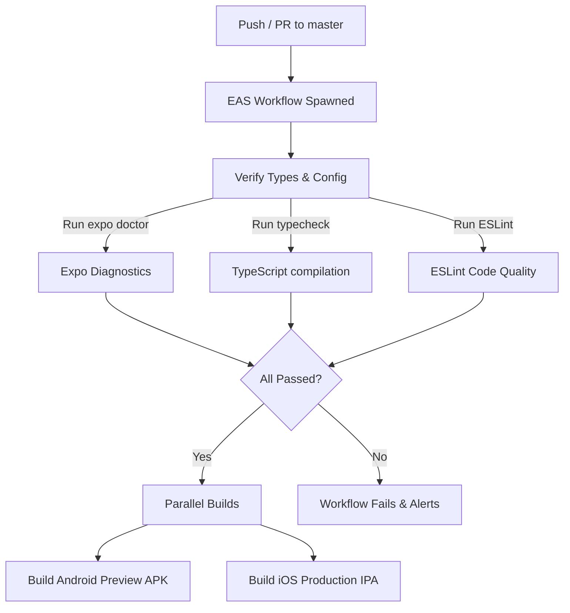

# 📍 Where's my family!!

> **Enterprise-Grade Private Family Tracking & Diagnostics App**
> Built with Expo, TypeScript, React Native Maps, and EAS Workflows.

---

## 🚀 Overview

**Where's my family!!** is a secure, cross-platform location-sharing and tracking application designed for family circles. The application provides instant location visibility on a rich interactive map, status indicators (like battery levels, phone state, and relative distance), panic alarms, and persistent background location monitoring that survives device restarts.

This repository is integrated directly with **Expo Application Services (EAS)** for automated Quality Assurance and cloud-native builds (Android APKs and iOS IPAs).

---

## ✨ Primary Features

### 🗺️ Live Family Dashboard
* **Dynamic Interactive Map**: Beautiful dark-mode maps showcasing your family members' positions, updated in real time.
* **Precise Family Status Cards**:
  * **🔋 Battery Tracker**: Real-time battery percentages and charging indicators.
  * **🛰️ Last-Seen Logs**: Precise relative distance calculation in miles using the Haversine formula and timestamps of the last received coordinates.
  * **📱 Device Activity**: Displays whether the phone is unlocked/active or locked.
* **📍 24H Location Trails**: Toggle to visualize complete path histories (breadcrumbs) of family members over the last 24 hours.

### 🔄 Reboot-Resilient Background Tracking
* **Always-On Background Daemon**: Continues updating the backend database with high-accuracy coordinates even when minimized or fully closed.
* **Android Boot Receiver**: Autostarts on boot complete (`RECEIVE_BOOT_COMPLETED`) without requiring manual intervention.
* **iOS App Relaunch Support**: Wakes the app on significant location movements, preventing native OS terminations.

### 🔧 Premium Diagnostic & Triage Console
* **In-App Terminal**: Sliding neon-green terminal window displaying live log entries (e.g., GPS pings, sync logs, and background tasks).
* **Native Log Share Sheets**: Easily export structured logs via text, email, or system clipboards to debug without developer cables.

---

## 🛠️ Automated Cloud CI/CD (EAS Workflows)

We utilize **EAS Workflows** to manage code quality, linting, formatting, type-safety checks, and parallel app compilations fully in the cloud.

The **`.eas/workflows/regression-test.yml`** workflow runs on every push and pull request to the `master` branch:



---

## 📦 Developer Guide

### Prerequisites
* **Node.js** (LTS or latest)
* **npm** or **Yarn**
* **Expo Go** app installed on your test devices

### Setup
1. Clone the repository:
   ```bash
   git clone https://github.com/fkcurrie/wheres-my-family.git
   cd wheres-my-family
   ```
2. Install dependencies:
   ```bash
   npm install
   ```

### Local Development Scripts
* 🚀 **Start Metro Bundler**: `npm start`
* 🤖 **Run on Android**: `npm run android`
* 🍎 **Run on iOS**: `npm run ios`
* 🩺 **Check Project Health**: `npx expo doctor`
* 🏗️ **Compile Check**: `npm run typecheck`
* 🚨 **Quality Audit (ESLint)**: `npm run lint`
* 💅 **Autoformat Code**: `npm run format`

---

## 🛡️ Privacy & Security

This is a private, family-centric repository.
* Coordinates are kept secure and shared only within defined private channels.
* Tracking can be fully disabled in the app settings at any time.
