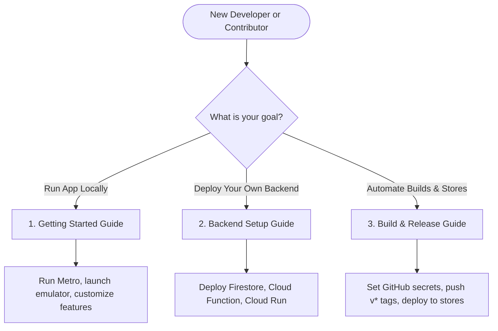

# 📚 "Where's my family!!" Documentation Portal

Welcome to the central documentation hub for **"Where's my family!!"**. Whether you are looking to run the mobile tracker locally, deploy your own sovereign cloud backend, or configure automated release pipelines in GitHub Actions, you will find complete, step-by-step guides here.

---

## 🗺️ Where to Start?

Depending on your role and goals, we recommend starting with the following paths:



---

## 🗂️ Documentation Index

### 1. 🚀 [Getting Started & Developer Guide](getting-started.md)

- **Who it is for:** New developers setting up their workstations to write client-side code.
- **What is covered:**
  - System Architecture overview and connection flows.
  - Zero-Knowledge client-side E2EE cryptography (AES-256-CBC) and backward compatible fallbacks.
  - Workstation dependencies (Node.js, JDK 17, Android Studio SDK, emulator).
  - Core mobile workflows (onboarding, location daemon tracking, battery indicators, map zoom pans).
- **Start here if:** You want to run the app in an emulator or test device.

### 2. ☁️ [Sovereign Backend & Self-Host Guide](backend-setup.md)

- **Who it is for:** System administrators, family leads, or developers wanting to host their own isolated, private backend stack.
- **What is covered:**
  - Backend architecture: Firebase/Firestore native database, Cloud Functions 2nd Gen, and Cloud Run dashboard.
  - API Security rules, `X-Mantle-Key` headers, and prototype pollution protection.
  - Step-by-step setup to establish a free GCP project, enable services, deploy functions, build the web dashboard, and connect your mobile client.
- **Start here if:** You want to secure your family's data on your own Google Cloud project.

### 3. 📦 [Build, Release & CI/CD Pipelines](build-and-release.md)

- **Who it is for:** Release managers or developers setting up automated pipelines for TestFlight and Google Play Console.
- **What is covered:**
  - Native prebuild instructions and local Gradle / Xcode compilation.
  - Repository Action Secrets walk-through.
  - In-depth review of `.github/workflows/android-build.yml` and `ios-build.yml`.
  - Xcode 26 `simctl` simulator priming fixes and non-interactive manual-signing helper scripts.
  - App Store "What's New" release notes guidelines.
  - Pre-commit checklist (TS typecheck, ESLint audits, DOM testing).
- **Start here if:** You are ready to publish build updates or want to configure automated releases.

---

## 🚨 Pre-Commit Quality Standards

Before pushing any branches or tags to the remote repository, ensure your environment is verified:

1. **Static Analysis & Linting:**

   ```bash
   # Run TypeScript compiler syntax check
   npm run typecheck

   # Run ESLint validation
   npm run lint
   ```

2. **Dashboard Verification:**
   ```bash
   # Check scripting, CDNs, and DOM layouts
   node scratch/verify_dashboard.js
   ```
3. **Execution Verification:**
   Use our native orchestration pipeline scripts (`scratch/orchestrate.sh` or `scratch/orchestrate.ps1`) to perform automated end-to-end verification.
