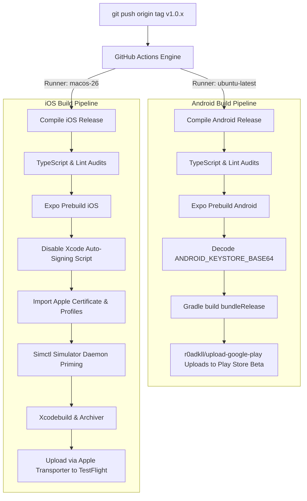

# 📦 "Where's my family!!" — Build, Release & Developer Workflow

This guide details the processes required to compile, build, and publish the **"Where's my family!!"** mobile application for Android and iOS. It covers local manual compilations, automated GitHub Actions pipelines, App Store submission practices, and instructions for continuous developer quality assurance.

---

## 🏗️ 1. Local Native Compilation (Expo Prebuilds)

The mobile application utilizes **Expo SDK 54** configured in **prebuild mode**. This means the native Android and iOS folders (`/android` and `/ios`) are fully reproducible.

### Native Prebuild Setup

To generate or refresh the native platforms from the React Native source code, execute the prebuild script:

```powershell
# For Android native directory
npx expo prebuild --platform android --no-install

# For iOS native directory
npx expo prebuild --platform ios --no-install
```

### Local Android Compilation

Once prebuild is finished, you can compile the production app bundle (`.aab`) locally:

1. Ensure `java -version` returns JDK 17.
2. Ensure you have your release keystore placed at `/android/app/release.keystore`.
3. Navigate to the `android/` directory and compile via Gradle:
   ```powershell
   ./gradlew bundleRelease `
     -Pandroid.injected.signing.store.file=[PATH_TO_YOUR_KEYSTORE] `
     -Pandroid.injected.signing.store.password=[YOUR_KEYSTORE_PASSWORD] `
     -Pandroid.injected.signing.key.alias=[YOUR_KEY_ALIAS] `
     -Pandroid.injected.signing.key.password=[YOUR_KEY_PASSWORD]
   ```
4. The output `.aab` file will be generated at `android/app/build/outputs/bundle/release/app-release.aab`.

### Local iOS Compilation (macOS only)

1. Ensure Xcode 26.0+ is installed on your macOS machine.
2. Navigate to the `ios/` folder and run `pod install` to bind native CocoaPods.
3. Open `wheresmyfamily.xcworkspace` in Xcode.
4. Disable automatic code signing and select your manual distribution certificate and provisioning profile in the Signing & Capabilities tab.
5. In your terminal, run `xcodebuild -workspace wheresmyfamily.xcworkspace -scheme wheresmyfamily -configuration Release archive` to archive the build.
6. Export the `.ipa` package using `xcodebuild -exportArchive` and your configured `ExportOptions.plist`.

---

## 🤖 2. Automated CI/CD GitHub Actions Workflows

To avoid expensive EAS build subscription costs and support unlimited build runs, we leverage **GitHub Actions**. Pushing a version tag matching `v*` (e.g., `v1.0.17`) to `master` automatically triggers parallel compile pipelines in the cloud.



### 🔑 Repository Action Secrets

Before running the pipelines, configure the following secrets inside your GitHub Repository under **Settings > Secrets and variables > Actions**:

| Secret Key                          | Description                                                              | Format / Content                          |
| :---------------------------------- | :----------------------------------------------------------------------- | :---------------------------------------- |
| `ANDROID_KEYSTORE_BASE64`           | Base64 string of your binary Google Play `.keystore` / `.jks` file       | Outlined in `android_keystore_base64.txt` |
| `ANDROID_KEYSTORE_PASSWORD`         | Password for your binary keystore                                        | Plain text password                       |
| `ANDROID_KEY_ALIAS`                 | Key alias in your keystore                                               | Plain text alias name                     |
| `ANDROID_KEY_PASSWORD`              | Password for your private key                                            | Plain text key password                   |
| `ANDROID_PLAY_STORE_JSON`           | Plain text JSON configuration of your Google Play Service Account        | GCP IAM Service Account Key JSON          |
| `APPLE_CERTIFICATE_BASE64`          | Base64 string of your iOS Apple Distribution `.p12` certificate          | Base64-encoded file                       |
| `APPLE_CERTIFICATE_PASSWORD`        | Password for your iOS distribution certificate                           | Plain text certificate password           |
| `APPLE_PROVISIONING_PROFILE_BASE64` | Base64 string of your Apple TestFlight App Store `.mobileprovision` file | Base64-encoded profile                    |
| `APP_STORE_CONNECT_API_KEY_ID`      | API Key ID from Apple App Store Connect portal                           | Plain text Key ID (e.g. `M12345ABC`)      |
| `APP_STORE_CONNECT_API_KEY_ISSUER`  | Issuer ID from Apple App Store Connect portal                            | UUID format (e.g. `abcd-1234-xx...`)      |
| `APP_STORE_CONNECT_API_KEY_KEY`     | Private `.p8` key content from App Store Connect API                     | Complete multiline PEM private key string |

### 🛠️ Key Pipeline Workflows Explanations

#### 1. The Xcode 26.0 & iOS SDK Simulator Daemon Priming

The iOS compile runner executes inside a `macos-26` virtual host running Xcode 26.0. When compiling React Native apps with native storyboard/interface assets, Xcode's interface builder (`ibtool`) can crash with connection failures if the native iOS simulator service daemon hasn't been primed.

The iOS pipeline avoids this entirely by running simctl priming commands to wake the simulator daemon before triggering `xcodebuild`:

```yaml
- name: Verify or Download iOS SDK Platforms
  run: |
    xcrun simctl list > /dev/null
    xcodebuild -downloadPlatform iOS || true
```

#### 2. Manual Provisioning Style Transition

Because Expo's CLI defaults to automatic code signing which requires active interactive Apple ID prompts, our build pipeline runs an automated, non-interactive Node helper that modifies the native Xcode project file (`project.pbxproj`) to force manual signing before launching Xcodebuild:

```javascript
const fs = require('fs');
const pbxproj = 'ios/wheresmyfamily.xcodeproj/project.pbxproj';
let content = fs.readFileSync(pbxproj, 'utf8');
content = content.replace(/ProvisioningStyle = Automatic;/g, 'ProvisioningStyle = Manual;');
fs.writeFileSync(pbxproj, content, 'utf8');
```

---

## 🚀 3. App Store Release & "What's New" Guidelines

To provide clear release notes and guidance for family testers on both TestFlight and Google Play, follow these instructions for every tag update:

### 🍎 iOS TestFlight Submission

The GitHub Actions workflow compiles the signed `.ipa` file and uploads it directly to App Store Connect (TestFlight) using `altool`. Because the upload tool does not natively accept inline release notes on submission:

- Compile a clear, bulleted list of what is new or changed in this version.
- Once the GitHub Actions pipeline finishes uploading, navigate to the **App Store Connect Portal > Apps > Where's my family > TestFlight**.
- Click on the newly uploaded build, and paste the release notes directly into the **"What to Test"** field under the **Test Information** section.
- **Example notes to paste:**
  - Added speed-adaptive telemetry rates
  - Implemented beautiful map zoom transitions

### 🤖 Android Google Play Console Submission

Because standard CLI scripts cannot automatically inject Android release notes during direct `.aab` uploads to the internal beta track:

1. Always write the exact, bulleted release notes to a temporary file called `whatsnew-android.txt` in the root of the project.
2. Keep the descriptions concise, user-friendly, and actionable.
3. During deployment, the developer can copy-paste this file directly into the **Google Play Console > Release > What's New** text box for the active draft.

---

## 💻 4. Get Started with Additional Development

To start extending the client-side app or testing custom dashboard layouts:

### Step 1: Pre-Commit Quality Checks

Always ensure your TypeScript syntax, lint rules, and code formatting are completely free of errors before committing:

```powershell
# Run the strict TS compiler (no compiler output)
npm run typecheck

# Check for code linting standards
npm run lint

# Automatically format modified source files
npm run format
```

### Step 2: Running the Alignment Check & Diagnostic Tools

Before publishing code or submitting updates, run the headless validation checks and connectivity alignment sweeps to verify dashboard integrations:

```powershell
# Perform headless dashboard DOM, CDN dependencies and scripting health audits
node scratch/verify_dashboard.js
```

### Step 3: Run the Orchestrated Verification Script

To test the entire mobile pipeline and secure connection tests end-to-end:

- **On Windows:**
  ```powershell
  powershell -ExecutionPolicy Bypass -Command ".\scratch\orchestrate.ps1"
  ```
- **On Linux:**
  ```bash
  chmod +x scratch/orchestrate.sh
  ./scratch/orchestrate.sh
  ```

### Step 4: Add New Features (Strict Case Sensitivity)

> [!IMPORTANT]
> The codebase is fully compatible with native **Linux developer nodes** and case-sensitive Ubuntu-based GitHub build systems. Under no circumstances should files be renamed or imported with mismatched casings (e.g., importing `./src/components/Onboarding` as `./src/components/onboarding`). Always verify that folder paths and imports match case-sensitively on disk.
