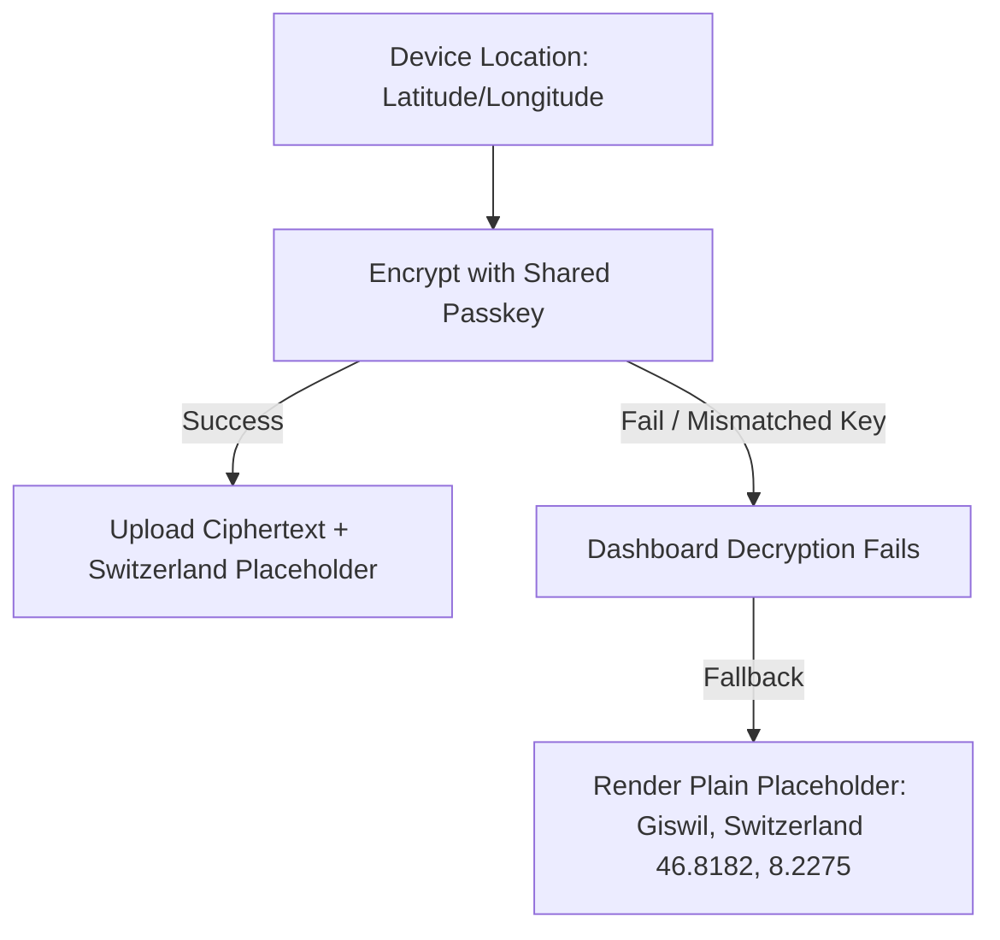

# 🔑 Sovereign Encryption Passkey Rotation & Mismatch Troubleshooting Guide

To achieve absolute location privacy, the **"Where's my family!!"** ecosystem employs **Zero-Knowledge client-side End-to-End Encryption (E2EE)**. This means your family's physical coordinates are converted into mathematically unreadable ciphertexts *on the phone* before they are sent to the cloud.

The security of this architecture depends entirely on a **shared family passkey**. This guide outlines how to manage, rotate, and troubleshoot passkey configurations.

---

## 🗺️ The Decryption Failure Symptom: "Why am I in Giswil, Switzerland?"

If a family member's location is rendered near the town of **Giswil, Switzerland**, it is not a GPS hardware bug. It is a **security feature working as designed**.

### 1. The Design Logic
To prevent Google Cloud, Firestore database administrators, or unauthorized network observers from tracing your family's daily movements, the application hides physical coordinates. 
* In the database, the plain-text properties for every member are hardcoded to `latitude: 46.8182` and `longitude: 8.2275` (the geographical center of Switzerland, near Giswil).
* The actual coordinates reside solely in the encrypted attributes `latEnc` and `lngEnc`.
* When the web dashboard or a family member's phone fetches locations, it attempts to decrypt the ciphertexts using their local shared passkey.
* **If decryption fails** (due to a typo, missing passkey, or a mismatched key), the software falls back to rendering the safe plaintext coordinates, showing that member in **Giswil, Switzerland**.

### 2. Diagnosis Steps
If you or a family member appears in Switzerland:
1. Verify if your passkey is configured. If you have not completed the onboarding key entry, your device cannot decrypt incoming trails.
2. Confirm that you are using the **exact same passkey string** as the rest of your family members.
3. Passkeys are fully **case-sensitive** and spacing-sensitive. "MyFamilyKey" is not the same as "myfamilykey" or "MyFamilyKey ".

---

## 🔄 Step-by-Step Shared Passkey Rotation

Over time, you may want to rotate your family passkey to maintain operational security or if a family device is compromised. Follow this sequence to prevent tracking disruption:

### Step 1: Inform Your Family
Coordinate a time to update the key. Because location decryption is client-side, changing the passkey will temporarily display members in Switzerland until all devices are synchronized.

### Step 2: Update Mobile Clients
Every family member must update the passkey on their mobile app:
1. Open the application.
2. Tap the **Settings** gear icon (or settings panel).
3. Under the **E2EE Passkey** field, delete the old string and enter the new, high-entropy passkey.
4. Tap **Save Settings** or **Onboarding Complete**.
5. Once saved, the app will automatically migrate and store the key inside the device's hardware enclave (iOS Keychain or Android Keystore via Expo SecureStore).

### Step 3: Update the Web Dashboard
1. Open your self-hosted **Web Dashboard Control Panel** URL in your web browser.
2. In the top-right header, enter the new **Shared E2EE Passkey** into the key field.
3. The dashboard will immediately utilize this new key to decrypt incoming Firestore coordinates and correctly render marker pins on the map.

---

## 🛡️ Best Practices for Passkey Security

- **Use High-Entropy Keys:** Avoid simple dictionary words or birthdays. Use a sentence with special characters or a generated passphrase (e.g., `Spring-Forest-49-Secure-Trails!`).
- **Do Not Write Keys to the Repo:** Never hardcode your family's passkey into service files (`Crypto.ts` or `MantleDB.ts`). The system is designed to load keys dynamically from secure storage, keeping code public-shareable.
- **Understand the Legacy Fallback:** The decryption system includes a try-catch legacy decrypter (XOR-hex symmetric). If you are updating from an extremely old client version, some historical trails may fail to render on the new dashboard. Simply clearing historical trails or performing a fresh manual sync will resolve the conflict.
